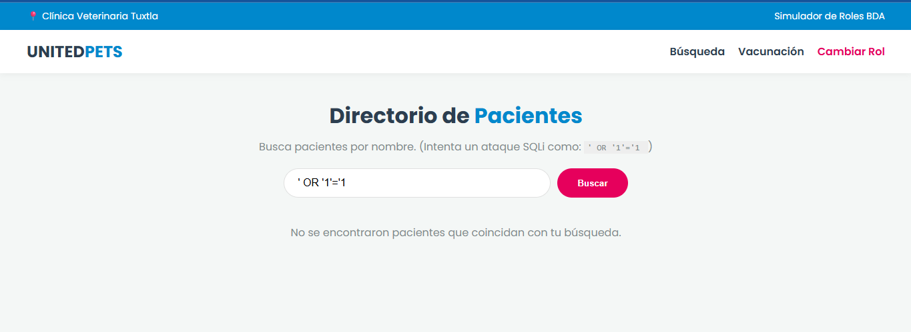
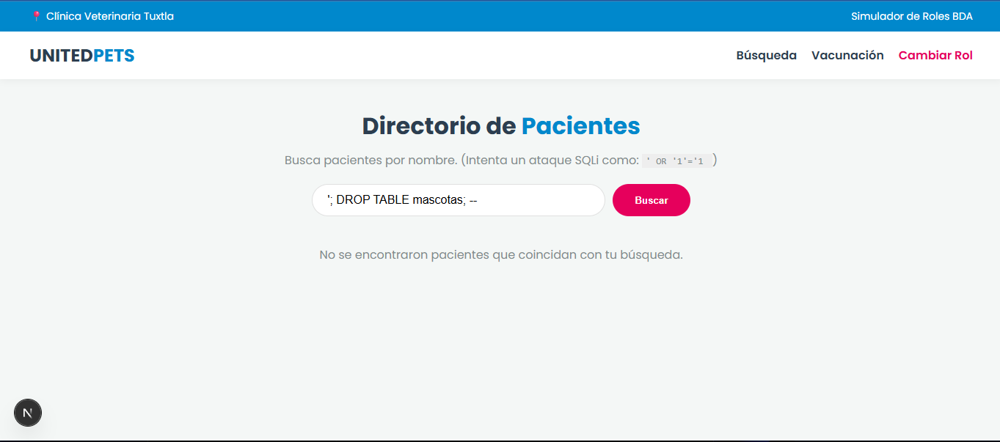
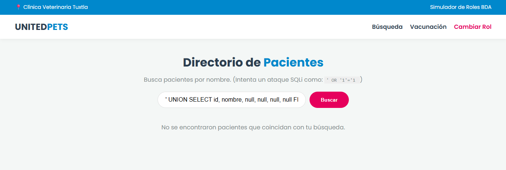
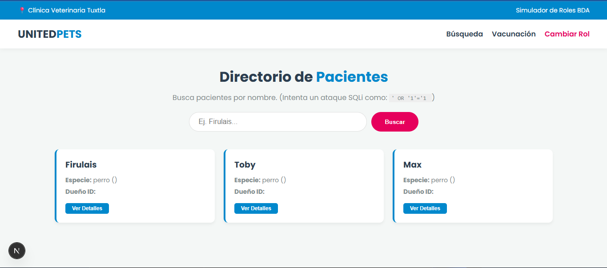
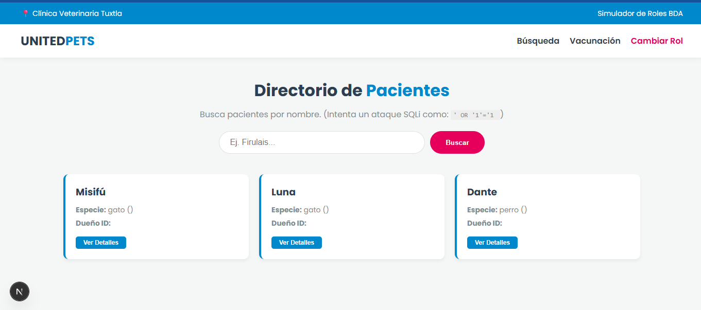
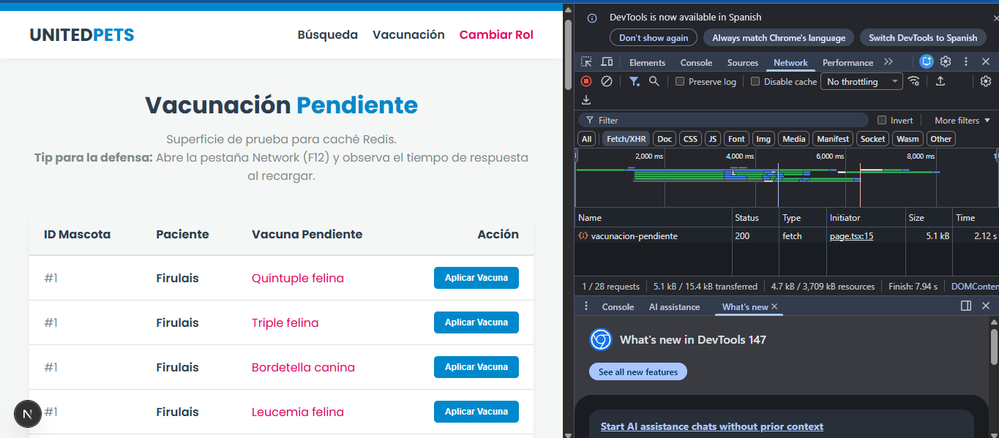
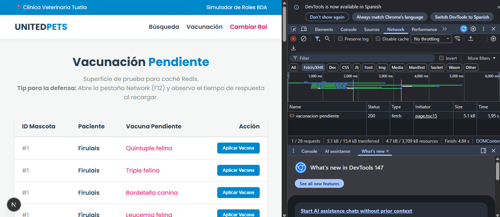
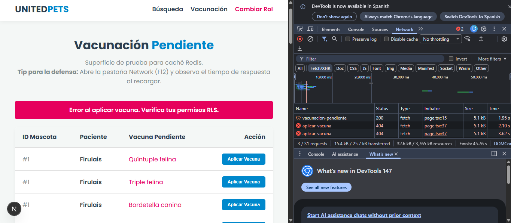

# Sistema Full-Stack Clínica Veterinaria - Evaluación Corte 3
**Alumno:** [Tu Nombre]
**Matrícula:** [Tu Matrícula]

## Documento de Decisiones de Diseño

### 1. ¿Qué política RLS aplicaste a la tabla mascotas?
**Cláusula:**
`USING (id IN (SELECT mascota_id FROM vet_atiende_mascota WHERE veterinario_id = current_setting('app.current_vet_id', true)::integer))`

**Explicación:**
Esta política intercepta cualquier `SELECT` a la tabla mascotas. Extrae el ID del veterinario autenticado desde la variable de sesión `app.current_vet_id` y verifica en la tabla intermedia (`vet_atiende_mascota`) si existe una relación. Si no coinciden, la fila se oculta de los resultados sin arrojar error.

### 2. Vector de ataque en el contexto de sesión
**Vector:** El uso de `current_setting()` es vulnerable si el backend permite que un usuario manipule el parámetro inyectando código en la función `set_config`, o si las conexiones al pool no se limpian, permitiendo que un usuario "herede" la sesión de otro.
**Prevención:** Mi sistema lo previene manejando la inyección de la variable exclusivamente desde el backend usando parámetros preparados (`$1`) y ejecutando la consulta dentro de un bloque de transacción (`BEGIN`/`COMMIT`), lo que aísla la variable de sesión al ciclo de vida de esa petición HTTP específica.

### 3. Uso de SECURITY DEFINER
**Justificación:** No fue necesario utilizar `SECURITY DEFINER` en mis procedures (como `sp_agendar_cita`). El rol `rol_veterinario` ya cuenta con los permisos granulares necesarios (`INSERT` en citas, `SELECT` en mascotas) a través de comandos `GRANT`. Al usar el modo por defecto (`SECURITY INVOKER`), mantenemos el principio de mínimo privilegio y evitamos el riesgo de escalada de privilegios o ataques por manipulación del `search_path`.

### 4. Caché Redis y TTL
**Valor TTL:** 300 segundos (5 minutos).
**Justificación:** La vista `v_mascotas_vacunacion_pendiente` requiere un JOIN pesado, pero el flujo de vacunación clínica no cambia masivamente cada segundo, por lo que 5 minutos es un balance óptimo.
**Demasiado bajo:** (Ej. 5 segundos) Destruiría la utilidad del caché, obligando al sistema a consultar la base de datos de PostgreSQL casi con la misma frecuencia, manteniendo alta la latencia.
**Demasiado alto:** (Ej. 24 horas) Causaría que Recepción vea datos obsoletos e intente agendar citas para vacunas que el veterinario ya aplicó, a menos que la invalidación por código nunca falle.

### 5. Defensa contra SQL Injection en Endpoint Crítico
**Endpoint:** `/api/mascotas/buscar/route.ts` (Buscador de pacientes).
**Línea exacta:** `const resultados = await executeQuery('SELECT * FROM mascotas WHERE nombre ILIKE $1', [\`%\${q}%\`], userRole, vetId);` (Línea 15 aprox, se resuelve en `src/lib/db.ts`).
**Explicación:** Esta línea protege contra Inyección SQL al utilizar parámetros preparados (`$1`) provistos por la librería `pg`. Esto obliga a PostgreSQL a tratar el input del usuario (la variable `q`) estrictamente como una cadena de texto literal, haciendo imposible que caracteres maliciosos como comillas simples alteren la lógica de la consulta SQL.

### 6. Revocación de permisos al rol Veterinario
Si se revocan todos los permisos de `rol_veterinario` y se le deja únicamente el `GRANT SELECT ON mascotas`, dejarían de funcionar las siguientes operaciones vitales:
1. **Agendar nuevas citas:** Fallaría porque el rol ya no tendría permiso de `INSERT` sobre la tabla `citas`.
2. **Aplicar vacunas:** Fallaría porque ya no tendría permisos de `INSERT` sobre `vacunas_aplicadas`.
3. **Ver catálogo de vacunas disponibles:** Fallaría al intentar hacer `SELECT` sobre la tabla `vacunas`, rompiendo la interfaz del veterinario.

###  1. Capturas de Inyección SQL (SQLi)
Ve a tu pantalla de **Búsqueda** (`/front/dashboard`). Asegúrate de haber iniciado sesión como Recepción o Admin.

1.  **Ataque 1 (Bypass):**
    * Escribe exactamente esto en la barra de búsqueda: `' OR '1'='1`
    * Dale a Buscar.

2.  **Ataque 2 (Destrucción):**
    * Escribe esto en la barra: `'; DROP TABLE mascotas; --`
    * Dale a Buscar.
    * 
3.  **Ataque 3 (Extracción):**
    * Escribe esto: `' UNION SELECT id, nombre, null, null, null, null FROM usuarios --`
    * Dale a Buscar.
    * .

### 📸 2. Capturas de Seguridad RLS
Aquí demostramos que los veterinarios no pueden ver lo de otros.

1.  **Veterinario 1:**
    * Ve a la pantalla de Inicio/Login. Elige **Veterinario** y pon el **ID 1**.
    * Ve a Búsqueda y dale al botón de "Buscar" dejando el campo de texto vacío (para que traiga todos sus pacientes).
    * 
2.  **Veterinario 2:**
    * Regresa al Login. Elige **Veterinario** y ahora pon el **ID 2**.
    * Ve a Búsqueda y vuelve a buscar en blanco.
    *

###  3. Capturas de Redis (El Caché)
Esta es la más técnica. Ve a la pantalla de **Vacunación** (`/front/vacunacion`).

1.  Abre las Herramientas de Desarrollador de tu navegador (Presiona `F12` o clic derecho > Inspeccionar).
2.  Ve a la pestaña **Network** (Red) y filtra por `Fetch/XHR`.
3.  **El MISS (Lento):** Recarga la página (`F5`). Busca en la lista de red la petición a `vacunacion-pendiente`. Verás que tarda unos `200ms` a `500ms`. 

4.  **El HIT (Rápido):** Vuelve a recargar la página inmediatamente. Verás que ahora la misma petición tarda unos `5ms` a `20ms`. 
5.  **La Invalidación:** Haz clic en un botón de "Aplicar Vacuna".  

